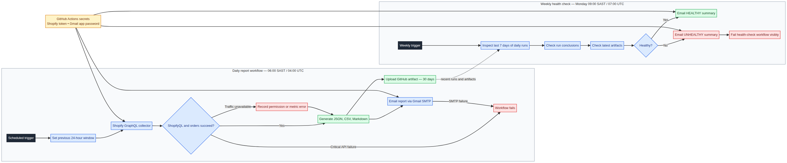

# Daily Shopify report automation

## Workflow visual

The [Mermaid source](shopify-workflow.mmd) and rendered PNG show the daily report path, weekly health check, GitHub secrets, Shopify/Gmail integrations, artifacts, and failure handling.

The workflow at `.github/workflows/shopify-daily-report.yml` runs every day at **06:00 Africa/Johannesburg** (04:00 UTC), collects the previous 24 hours of Shopify sales and traffic data, emails the report to the configured recipient, and retains the generated files as GitHub Actions artifacts for 30 days.

The workflow at `.github/workflows/shopify-weekly-health.yml` runs every Monday at **09:00 Africa/Johannesburg** (07:00 UTC). It checks the last seven days of daily report workflow runs, identifies failed or missing runs, checks whether the latest successful run has uploaded artifacts, and emails a health summary. A critical health finding makes the health-check workflow fail visibly in GitHub Actions.

## Required repository secrets

Add these under **Repository → Settings → Secrets and variables → Actions → New repository secret**:

| Secret | Value |
|---|---|
| `SHOPIFY_STORE` | Shopify `*.myshopify.com` domain |
| `SHOPIFY_ADMIN_TOKEN` | Admin API token with `read_orders` and `read_reports` |
| `GMAIL_USERNAME` | Gmail address used to send the report |
| `GMAIL_APP_PASSWORD` | Google 16-character app password, not the normal Gmail password |
| `EMAIL_TO` | Optional report and health-check recipient; defaults to `michaelmdiener@gmail.com` |

The Gmail sending account must have two-step verification enabled. Create an app password in the Google Account security settings and use that app password as `GMAIL_APP_PASSWORD`. Do not commit the app password or Shopify token to the repository.

## Shopify requirements

The token should have `read_orders` and `read_reports`. ShopifyQL may additionally require the app to be approved for the applicable protected customer data access. If ShopifyQL is unavailable, the workflow still creates the direct order export and records the reporting error in the Markdown and JSON files.

## Manual tests

After adding the secrets, open **Actions → Daily Shopify sales and traffic report → Run workflow**. A successful run sends the report email and uploads JSON, CSV, and Markdown artifacts. Open **Actions → Weekly Shopify report health check → Run workflow** to test the weekly health check manually. The health-check email identifies missing or failed daily runs and missing artifacts.
